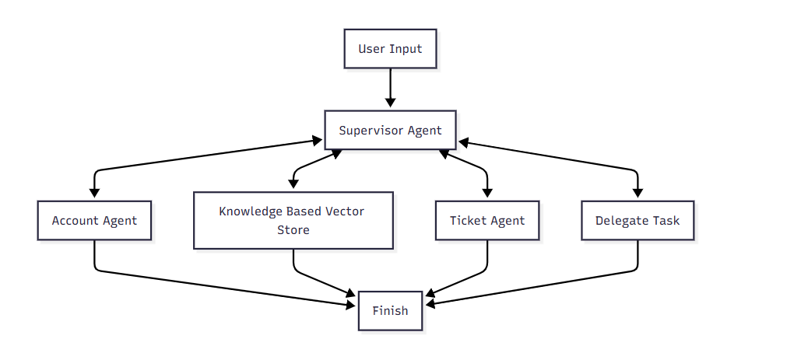
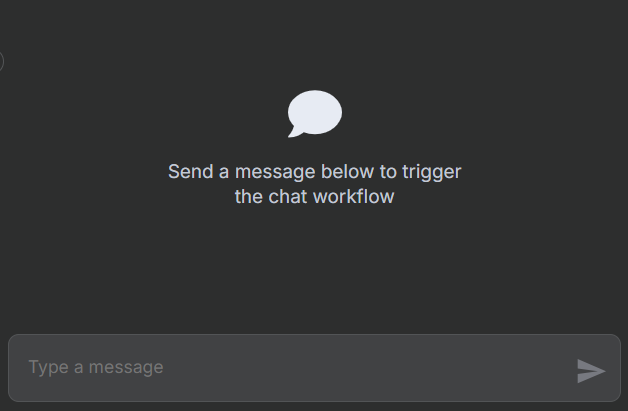

# 🛠️ ITSM Multi-Agent System with n8n, RAG, MCP, and Gemini

This project is an **Intelligent IT Service Management (ITSM) Multi-Agent System** powered by **n8n workflows**, **Google Gemini embeddings**, **RAG-based Knowledge Agent**, and **Modular Computation Protocol (MCP)** tools. It handles IT queries autonomously, with dynamic routing between specialized agents.

---

## 📌 Overview

This system automates IT service ticket handling for a banking environment using multiple AI agents orchestrated by **n8n**. It supports:

- Account lookup
- Error code diagnostics via RAG
- Ticket creation and escalation
- Knowledge Base response
- Email-based escalation (via Gmail)
- Session memory and retry handling
- Structured tool execution using the MCP pattern

---

## 🧠 Tech Stack Overview

| Component             | Description                                                                 |
|-----------------------|-----------------------------------------------------------------------------|
| **n8n**              | Visual workflow orchestrator used to route logic between AI agents          |
| **Google Gemini API**| `gemini-1.5-flash` model powers the reasoning, tool selection, and agent behavior                    |
| **Gemini Embeddings**| `text-embedding-004` model used to vectorize knowledge documents            |
| **Supabase Vector DB**| Stores and indexes error codes and solutions for RAG                        |
| **RAG (Retrieval-Augmented Generation)**| Retrieves relevant solutions based on input problems        |
| **MCP (Modular Computation Protocol)**| Ensures structured tool invocation and communication         |

---

## 🤖 Agents & Responsibilities

### 1. **Supervisor Agent**
- Orchestrates flow between all sub-agents
- Decides routing (account, ticket, KB, escalation)
- Handles escalation workflow via Gmail
- MCP tools: route, delegate, finish

### 2. **Clarifiying Prompt**
- Requests missing information (e.g., ticket ID or email)
- Ensures all inputs are complete before processing

### 3. **Account Agent**
- Retrieves account info by email
- Used to resolve `account_id` during ticket creation
- Tool: `get_account_info()`

### 4. **Ticket Agent**
- Retrieves existing ticket or creates a new one
- Handles ticket creation logic when issue is unresolved
- Tools: `get_ticket_info()`, `create_ticket()`

### 5. **Knowledge Agent (RAG) Tool**
- Uses Gemini embeddings + Supabase vector store
- Retrieves top-k relevant error codes and solutions

### 6. **Escalation Workflow**
- Uses Gmail API to send escalation alerts to support teams
- Triggered only when issue is unresolved after multiple retries

---

## 🔄 System Logic Flow



### Workflow Highlights:

* Agents request data from each other when missing (e.g., ticket creation uses account info).
* If KB match fails and no existing ticket found, system creates a ticket smartly.
* Repeated failure leads to escalation email.

---

## 📁 Project Structure

```
n8n_itsm_multi_agent/
│
├── workflows/
│   ├── core_workflow.json
│   ├── account_agent.json
│   ├── ticket_agent.json
│   └── upload_vector.json
│
├── data/
│   ├── account.json
│   ├── ticket.json
│   └── error_code.csv
│
└── README.md
```

---

## 🚀 Deployment Guide

### 1. **Import Workflows**

* Import the JSON files under `workflows/` into n8n UI
* Import the JSON files under `data/` into Google Sheets/other databases
* Each JSON represents a separate workflow

### 2. **Run Workflows**

* Mark the `Core Workflow` as Active


* Trigger the chat workflow by sending a message in the chatbox


### 3. **Interaction with Chat Agent**

* Chat with the ITSM Agent with prompts to get output


